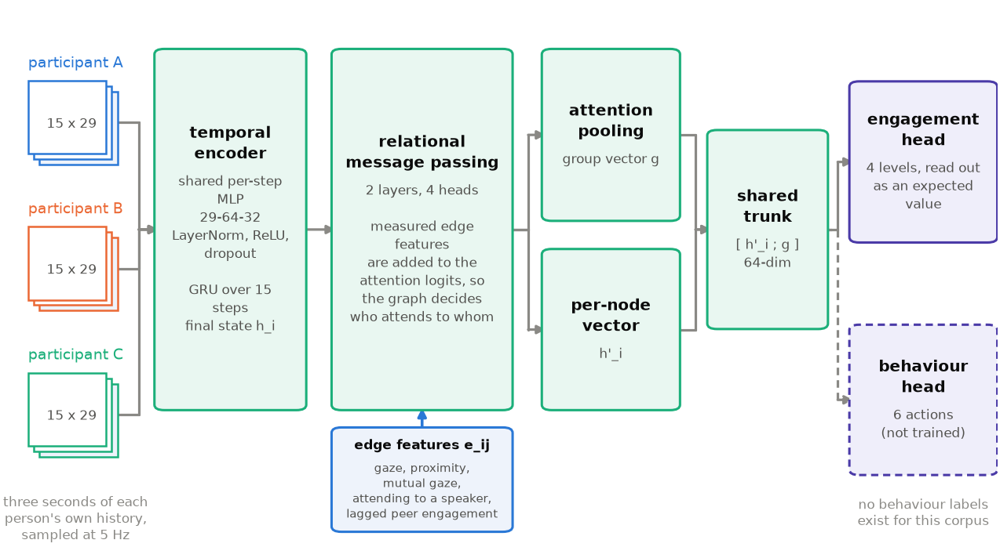
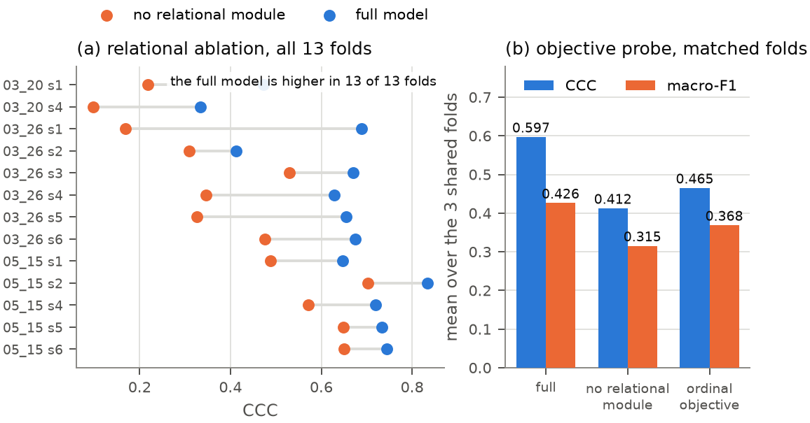
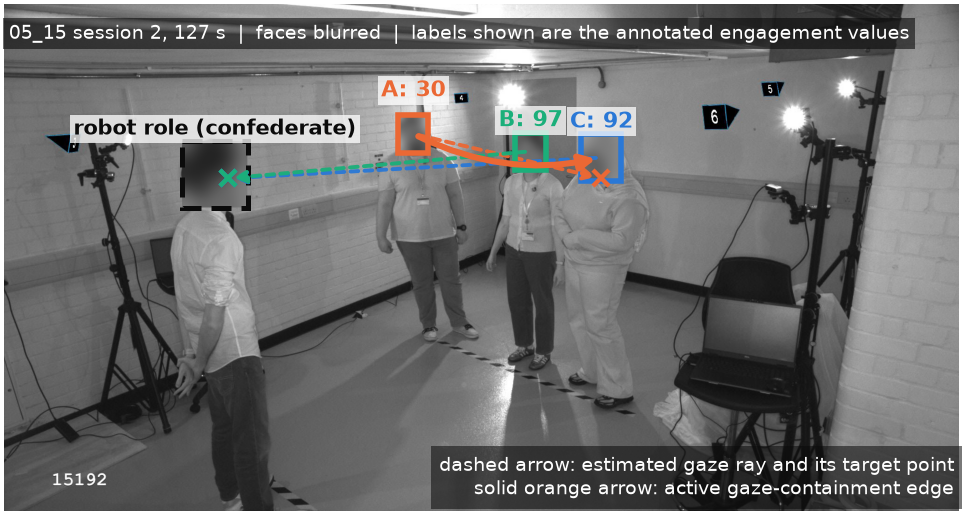

# CAMEO

**A Context-Aware Multimodal Engagement-Oriented interaction model for receptionist robots in complex environments.**

CAMEO estimates how engaged every person in a small co-located group is, continuously and
from a single camera, by scoring all participants jointly rather than one at a time. It was
built as an MSc research project at King's College London (Engineering Department, supervised
by Dr Oya Celiktutan) around a purpose-recorded corpus of three-participant interactions with
a robot receptionist.

The central idea: engagement in a group is not independent per person. Where someone looks,
who is speaking, and how engaged their companions were a second ago all carry information about
their own state. CAMEO encodes each participant as a node in a small directed graph, puts those
*measured* interpersonal quantities on the edges, and lets attention over that graph decide who
informs whom.



## Results

Evaluated under leave-one-session-out cross-validation over 14 folds, so no participant, session
or seating arrangement is ever shared between training and test.

| metric | CAMEO | reference |
|---|---|---|
| Concordance correlation (CCC) | **0.649** | 0.59, best comparable group-level result in the literature |
| CCC after post-hoc recalibration | **0.728** | no extra training, no held-out label used |
| Binary engaged/disengaged accuracy | **81.1 %** | 58.8 % majority class |
| Four-level accuracy | 55.6 % | 4-class, macro-F1 0.468 |
| Mean absolute error | 23.6 pts (18.9 recalibrated) | on a 0–100 scale |

**The relational module is what earns this.** Against an otherwise identical non-relational
baseline trained in the same run under matched folds, seeds and schedules, the graph raises CCC
from 0.426 to 0.632 and macro-F1 from 0.326 to 0.453, and wins in all thirteen folds
simultaneously on CCC, macro-F1 and MAE.



Two further findings:

- **The dominant residual error is predictive shrinkage, not class confusion.** Predictions
  compress toward the corpus mean by a factor of roughly 0.6. Identifying this made it correctable
  post hoc, improving CCC in 14 of 14 folds and replicating on a second, independent 20-fold
  training pool where it improved all 20.
- **The interpersonal regularities the model exploits are measurable with no model involved.**
  Gaze at a companion versus at the receptionist separates by 44 points of engagement; co-present
  participants share an engagement level 54.7 % of the time against 36.7 % under independence;
  and 78.3 % of level changes coincide with a peer's within two seconds.

## How it works

**Input** is one camera view of the group. There is no cross-camera identity linking and no
per-person calibration.

1. **Feature extraction** (`dataExtraction/`) recovers, per participant per frame: gaze target
   (robot / peer / elsewhere) via Gaze-LLE, action units and emotion via OpenFace 3.0, head-gaze
   angles, and a visual speaking proxy from mouth motion. This runs on small, oblique, greyscale
   faces that a classical detector does not find at all, reaching 91 % mean facial coverage.
2. **Annotation** (`datasetPrep/`) provides a continuous annotation tool and the identity
   reconciliation that maps detector tracks onto the annotator's participant A/B/C. Labelling is
   frame-by-frame for every participant, not segment-level for one designated target — necessary
   because 66 % of ten-second windows span more than one engagement level.
3. **The model** (`modelTraining/model.py`) encodes each participant's own three-second history
   with a shared MLP and a GRU, then runs two layers of four-head relational message passing in
   which measured edge features (gaze, proximity, mutual gaze, attending-to-a-speaker, and each
   neighbour's engagement at a one-second lag) are added to the attention logits. A shared trunk
   concatenates the per-node vector with an attention-pooled group vector; the engagement head
   reads out four levels as an expected value.
4. **Robot integration** (`modelTraining/furhat_*.py`) drives a virtual or physical Furhat from
   the model's per-frame estimates.

## Corpus

Twenty sessions of three co-present participants interacting with a robot receptionist:
88,562 person-frames from approximately 871,000 raw frame-level ratings, across four recording
dates and 109 minutes of annotated footage.



**The recordings and all extracted features are deliberately not in this repository.** They are
biometric personal data under UK GDPR from an ethics-approved study whose consent does not cover
third-party secondary use, and the ethics assessment for this project concluded the dataset
should not be released in a form that enables trivial repurposing. Every figure here showing
participants is face-blurred. What is published is the code and the methodology.

## Repository layout

```
dataExtraction/       single-camera feature extraction
  facial_keypoints_extraction/   landmarks, blendshapes, head pose, gaze target, audio features
  openface3/                     action units, emotion, mouth-motion speaking proxy
  ../run_batch_*.py              batch drivers over sessions (repository root)

datasetPrep/          continuous engagement annotation, identity reconciliation,
                      review clip rendering, heuristic first-pass labelling

modelTraining/        model.py               the relational architecture
                      build_*_dataset.py     frame-level graph construction
                      train*.py              leave-one-session-out training
                      session_tracker.py     whole-session Hungarian + velocity tracker
                      render_*.py            prediction and tracking overlay videos
                      furhat_*.py            Furhat driver, action replay, primitive checks
                      audit_*.py, diagnose_*.py, sanity_check*.py

finalReport/          figures_src/   every figure and reported number in the write-up,
                                     regenerable from the data
                      (the dissertation itself is not yet in this repository)

docs/design-notes.md  architecture and methodology decisions, including the ones
                      later revised by evidence
```

## Running it

```bash
python -m venv .venv && source .venv/bin/activate
pip install -r requirements.txt
```

The pipeline expects recordings under `Data/<date>/<session>/` and writes to `outputs/`, both
of which are gitignored. With data in place the order is: extract features
(`run_batch_facial_keypoints_*.py`, `run_batch_gaze_target.py`,
`dataExtraction/openface3/run_batch_openface_cam2.py`), annotate
(`datasetPrep/continuous_labeler.py`), build graphs
(`modelTraining/build_continuous_dataset.py`), then train
(`modelTraining/train_continuous.py`).

Two external pieces are referenced but not vendored here: the YOLOv5-based head detector bundled
with MCGaze, which `facial_keypoints_extraction/src/.../head_detector.py` loads from a sibling
`yolo_head/` directory, and the Gaze-LLE weights, fetched at runtime via `torch.hub`.

## A note on the behaviour head

The architecture includes a six-action behaviour policy head sharing the trunk with the
engagement head. **It is architected but never trained**: no behaviour labels were annotated for
this corpus, so it is excluded from the loss and `train.py` raises if asked to train it. The
robot demo maps engagement to actions with a hand-written rule, not a learned policy. This is
stated plainly in the code and in `docs/design-notes.md`, where it corresponds to the second
of three training strategies considered.
